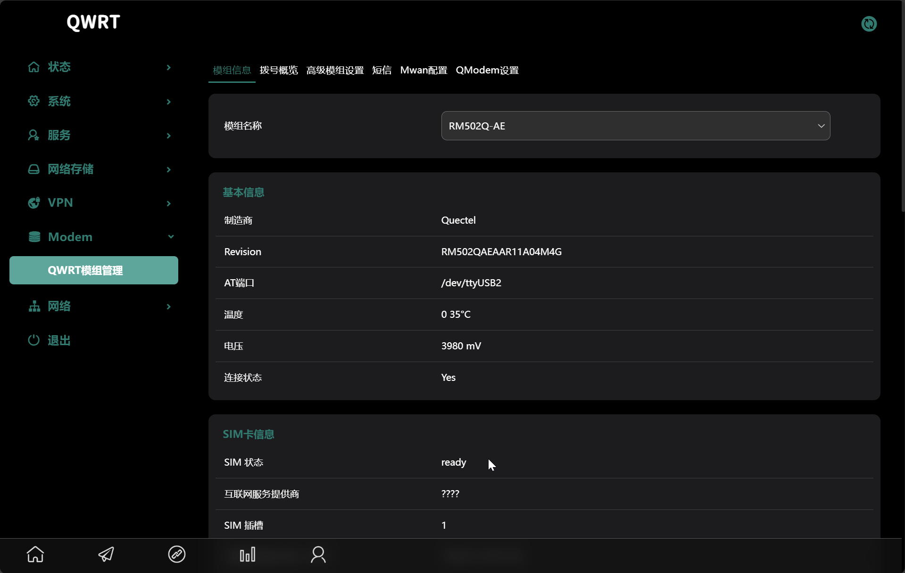
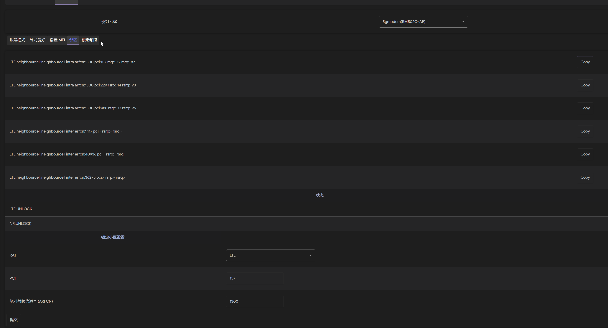
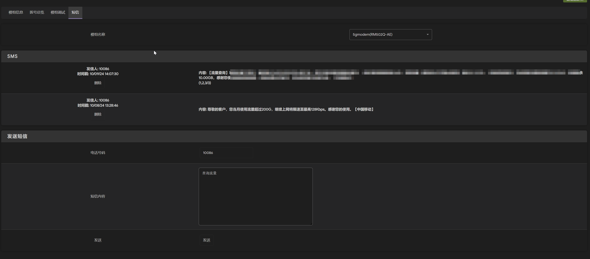

# QModem

这是一个模组管理插件，兼容 Openwrt 21及之后的版本，使用 lua 开发，因此同时兼容 QWRT/LEDE/Immortalwrt/Openwrt

(使用 js luci 时请添加 luci-compat 软件包)

# 使用方法

### 增加feed源

```
echo >> feeds.conf.default
echo 'src-git modem https://github.com/FUjr/modem_feeds.git;main' >> feeds.conf.default
./scripts/feeds update modem
./scripts/feeds install -a -p modem
```

### 集成软件包

```
make menuconfig
```

### 选择软件包

```
LuCI --->
3. Applications --->
 -*- luci-app-qmodem.............................. LuCI support for QWRT Modem
< > luci-app-qmodem-hc..................................... hc-g80 sim switch
< > luci-app-qmodem-mwan........................ Luci qwrt modem mwan support  
<*> luci-app-qmodem-sms.......................... Luci qwrt modem sms support 
< > luci-app-qmodem-ttl.......................... Luci qwrt modem ttl support   
```

# 鸣谢

在模组管理插件的开发过程中，参考了以下仓库


| 项目                                         | 参考内容             |
| -------------------------------------------- | -------------------- |
| https://github.com/Siriling/5G-Modem-Support | 模组列表和部分at实现 |
| https://github.com/fujr/luci-app-4gmodem     | 沿用该项目大部分思想 |
| https://github.com/obsy/sms_tool             | AT命令发送工具       |

# 项目介绍

## 为什么选择该项目

- **稳定性**：通过缓存和减少 AT 指令的次数，提高了系统的稳定性。
- **可扩展性**：最小化 API 端点和统一后端程序设计，便于二次开发和扩展。
- **可靠性**：功能分离设计，确保核心功能的稳定性，即使其他功能出现问题也不影响主要使用。
- **多模组支持**: 根据 slot 定位模组，模组和配置有一对一的绑定关系，即使重启或热插拔模组也不会造成模组和配置混淆。
- **短信支持**: 长短信合并、中文短信发送
- **多语言支持**: 开发时将语言资源分离，可以添加需要的语言

#### 缓存机制

- **减少了发 AT 指令的次数**：通过缓存模组信息，降低了直接与模组通信的频率，从而提高了系统的稳定性。
- **多窗口支持**：即使同时开启多个窗口查看模组信息，也不会导致模组死机。

#### API 设计

- **最小化 API 端点**：暴露尽可能少的 API 端点，大部分模组信息和模组设置均使用同一端点，简化了二次开发。
- **统一后端程序**：所有与拨号无关的模组通信均采用统一的后端程序，便于维护和扩展。

#### 功能分离

- **解耦合设计**
  - 模组信息和设置、模组拨号、短信收发、多 WAN 设置、TTL 设置 模块解耦
  - 前后端解耦，便于后续升级c语言实现的后端 和更先进的 js luci
- **稳定性保障**：确保即使某一些功能挂了也不影响最重要的上网稳定性。

### 主程序

项目主程序为luci-app-qmodem（原谅我将后端程序也放在了这里），有模组信息、拨号总览、模组调试三大功能块。由于主程序在这里，因此其他功能依赖该程序。

#### 模组信息

1. 页面顶部有一个模块选择器，可以选择不同的模块
2. 支持显示sim卡异常状态
3. 支持显示模组基本信息，在有sim卡时会额外显示 SIM卡信息 ，在拨号成功后则会显示网络信息和小区信息



#### 模组调试

页面顶部有一个模块选择器，可以选择不同的模块,选择后可进行拨号模式、制式偏号、IMEI设置、锁小区、锁频段等设置，当然这些功能需要模组支持




#### 拨号总览


##### 全局配置

提供全局性的配置选项，允许用户进行统一的模组配置。

- **模组扫描**：自动扫描主机上的模组设备。
- **手动配置**：该选项关闭时，每次开机会运行模组扫描，也会根据hotplug事件增删模组。（删除模组时不会删除配置信息，但是会将模组状态设置为已禁用，增删模组都会触发拨号配置重载）
- **重新加载拨号**：重新加载模组的配置文件，确保配置生效。
- **拨号总开关**: 拨号总开关，启用后才会进行拨号

##### 配置列表

显示当前配置的模组列表，提供模组的详细信息。

- **模组位置**：显示模组的物理位置或插槽编号。
- **状态**：显示模组的当前状态（例如：已启用、禁用）。
- **别名**：设置别名后，网络接口名会设置为别名，模块选择器和日志也会显示别名。因此别名不可重复、不得含有空格及特殊符号

##### 拨号状态和日志

启用拨号后实时显示模组的当前拨号信息和拨号日志，便于用户查看模组的详细运行情况和排查问题。可以下载或清除日志。

### 短信

包名 luci-app-qmodem-sms ，该页面主要用于短信(SMS)的管理和发送，页面顶部有一个模块选择器，可以选择不同的模块,页面会显示与该模块相关的短信信息。用户可以查看和管理已有的短信记录，并且可以向指定号码发送新的短信。


**短信列表**

页面中部显示了一个短信列表，每条短信包括**发信人**、 **时间**、**内容**，每条短信旁边都有一个删除按钮，点击可以删除该条短信。

**发送短信**

- **电话号码**：输入接收短信的电话号码。如10086、8613012345678
- **短信内容**：中文短信会在前端使用js编码，ascii短信则在后端编码

## 开发介绍和开发计划

### 开发介绍

### sms-tool_q

#### 介绍

 添加了补丁以支持发送原始 pdu ，其余与原项目相同
### luci-app

#### 坑

为了给未来切换 js luci 做准备的同时兼顾lua luci的兼容性，我使用脚本写了一个rpcd的warpper来调用modem_ctrl，目前的rpcd仅有获取信息功能，无设置功能。在htdoc下实现了一个简易的首页信息展示
#### 坑

原来设计的扫描所有usb设备的方法在部分路由器下存在性能问题，同时 at探测功能会发送非预期的at指令，因此策略修改为：提前把模组可能的slot写入配置文件，只扫描特定slot（目前认为不需要对普通用户暴露该功能，故没做luci界面）
#### 坑

led 状态的实现，目前led状态的实现相当不优雅，被集成在了modem_dial里，每次拨号状态改变时会触发led状态的修改，因此如果脚本非正常退出等情况出现时，灯会失效。灯与slot的绑定状态同样暂未考虑对用户暴露
#### 坑

更改了配置文件名称，ttl mwan hc 暂未经测试，可能出现错误
对于2、3号坑可以参考 ```luci/luci-app-qmodem/root/etc/uci-defaults/99-add-5g-handler``` 添加你的设备

### 开发计划


| 计划                                              | 进度       |
| ------------------------------------------------- | ---------- |
| 将后端程序与luci-app完全分离                      | 0          |
| 修复quectel-CM乱call udhcpd和删除默认路由表的问题 | 0          |
| 加入pcie模组支持                                  | 实验性支持 |
| 自己实现at收发程序                                | 50%        |
| 切换js luci                                       | 5%         |
| 修复ipv6                                          | 5%         |
| 优化模组扫描逻辑                                  | -100%      |
| 模组led展示                                       | -100%      |
